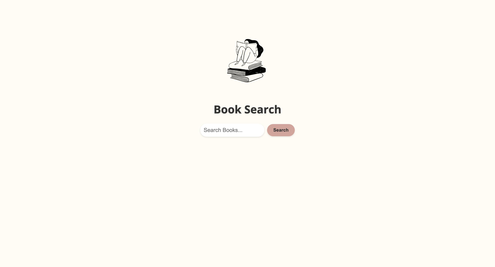
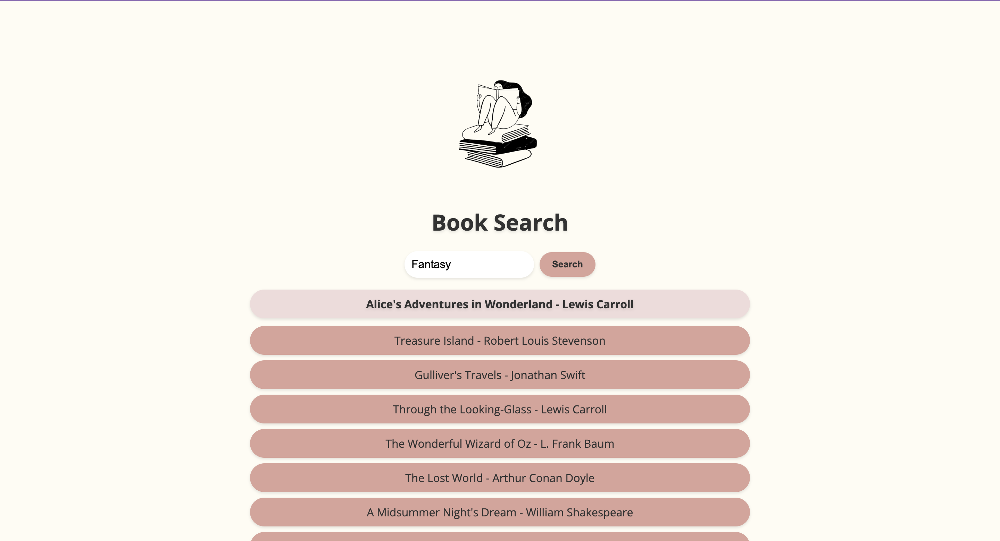
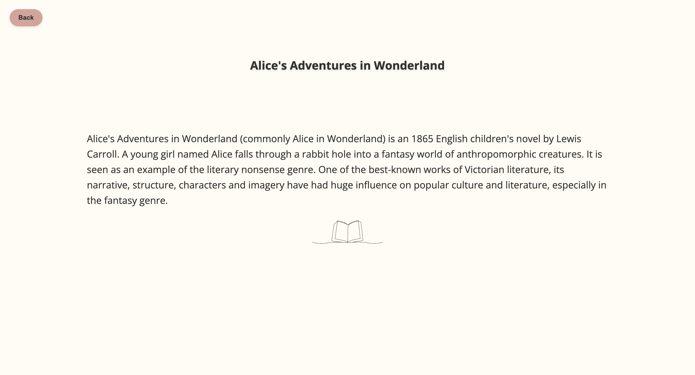
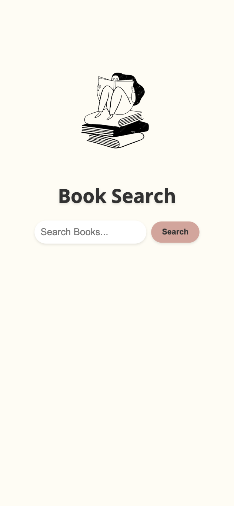
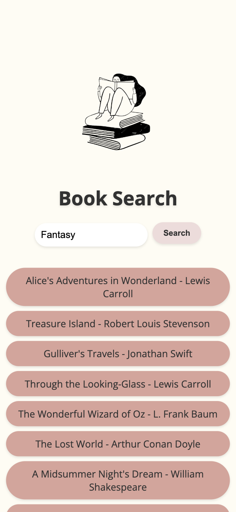
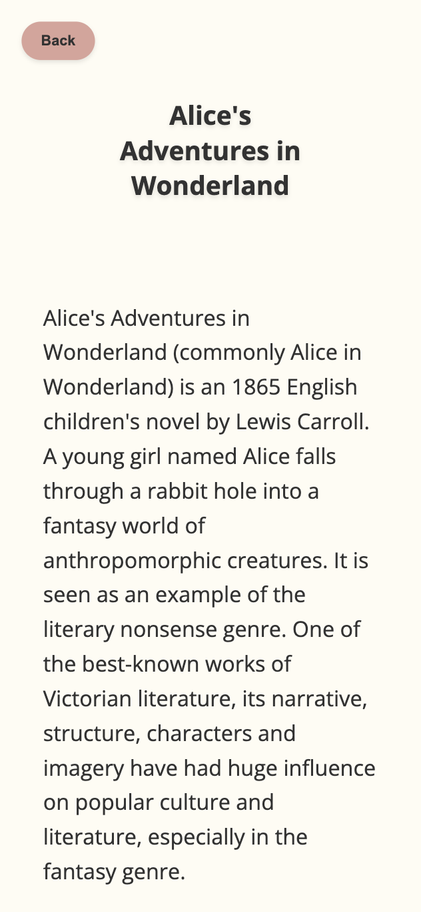

# **Book Search**

🔗 [WebSite](https:)

This is a simple web application that allows you to search for books based on a category. The application is built using HTML, CSS, and JavaScript.

## **Features**

 1. Search for books based on a category

 1. View book details, including title and description

 1. Responsive design for optimal viewing on desktop and mobile devices

## **Technologies Used**

 - HTML

 - CSS

 - JavaScript

 - Open Library API

## **Usage**

To search for a book, enter a category in the search box and click the "Search" button. The application will display a list of books that match the category. Click on a book to view its details.

## **Acknowledgments**

Open Library API for providing access to book data

## Screenshots

